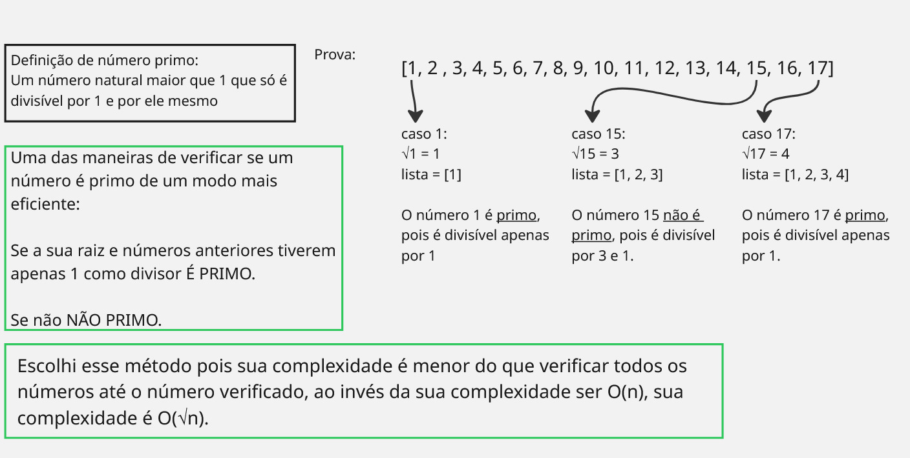

# 🔍 Filtro de Números Primos em C#

Este projeto implementa uma funcionalidade que recebe uma lista de números naturais como entrada e retorna apenas os **números primos** da lista, ordenados de forma crescente.

## 🛠️ Tecnologias Utilizadas

- [.NET 8 SDK](https://dotnet.microsoft.com/)
- C#
- xUnit (para testes unitários)

---
<br/>

## Como Rodar o Projeto

### 1. Clone o repositório

Abra o terminal e execute:

```bash
git clone https://github.com/vichelly/desafio-junior-riscos-de-credito.git
```

### 2. Instale o .NET SDK

Certifique-se de que o .NET 8 ou superior esteja instalado.

Para verificar:

```bash
dotnet --version
```

### 3. Execute o projeto

Entre na pasta correta para rodar o projeto:
```bash
cd desafio-junior-riscos-de-credito
```

Execute o projeto
```bash
dotnet run
```

#### Para alterar a lista que deve ser analisada basta alterar em Program.cs

```bash
// Entrada de números exemplo
var entrada = new List<int> { 6, 4, 2, 3, 1, 5, 10, 7, 9, 8, 17, 15, 20, 21, 0 };
```
<br/>
## Como Rodar os Testes Unitários

### 1. Instale os pacotes de testes necessários

Entre na pasta correta para rodar o projeto:
```bash
dotnet add package xunit
dotnet add package xunit.runner.visualstudio
dotnet add package Microsoft.NET.Test.Sdk
```

### 2. Rode os testes

Entre na pasta correta para rodar o projeto:
```bash
dotnet test
```
<br/>

## Complexidade do algoritmo

Documentação feita no [Miro](https://miro.com)

<br/>
No fim o algoritmo ficou com complexidade O(m√n) <br/>
onde “m” é o tamanho da lista recebida e “n” é o tamanho da lista de números checados em cada número da lista.
